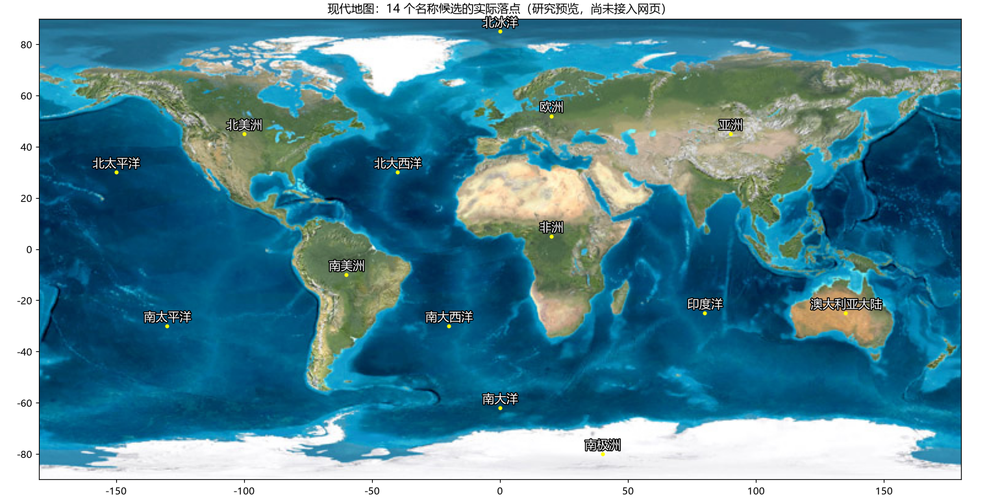
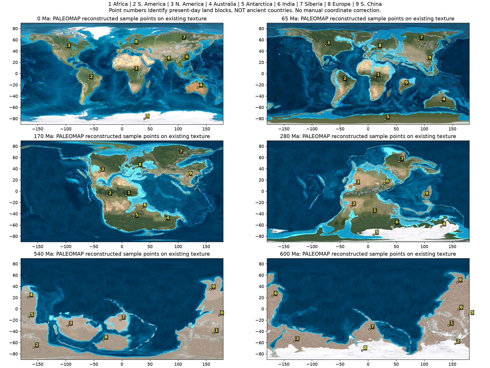

# 地名数据匹配调查

调查日期：2026-09-17。目标：尽量复用公开数据为现有 26 张底图补充名称，允许近似；本轮先调查和整理候选，不改动网站运行代码。

## 结论

有可用数据，适合分成两个独立图层：

1. **现代地理名称**：从 Natural Earth 实际下载的多语言数据中选出 14 个名称，包括 7 个大陆要素和 7 个海洋分区（大西洋、太平洋各分南北，并非“七大洋”）。中文名做了简体化及命名统一。标注点由本次人工选取，并检查位于对应源数据多边形内；在现有现代底图上做了叠图检查。
2. **现代位置的远古参照**：将 9 个现代内陆样点通过 GPlates 的 PALEOMAP 模型重建到全部 26 个时间点，共取得 234 条坐标。对全部年代做概览级叠图检查，位置大体对应现有底图的大陆地块。用保守的蓝色像素筛查暂缓 39 条海岸/浅海候选，余下 **195 条作为近似候选**。这不是 195 个不同地名，也不是精度验证通过的 195 个点。
3. **真正的古地名**：本轮下载的文件不是现成的“盘古大陆、冈瓦纳大陆、特提斯洋”中文地名库。PALEOMAP 板块多边形的 NAME 字段为空；政治边界文件里有现代国家名称，不能把它们当作远古国家名称使用。古大陆、古海洋的正式名称和有效年代仍需额外整理，不能仅凭坐标重建自动生成。

## 实际拿到的数据

### Natural Earth

- [自然地理名称下载页](https://www.naturalearthdata.com/downloads/10m-physical-vectors/10m-physical-labels/)
- `ne_10m_geography_regions_polys`：1,047 条自然地理区域记录，包含 7 条 Continent 要素。
- `ne_10m_geography_marine_polys`：306 条海洋地理记录，包含 7 条 ocean 要素。
- 两份数据都包含中文名称字段；陆地文件字段为 `NAME_ZH`，海洋文件为 `name_zh`。
- 许可：[Public domain](https://www.naturalearthdata.com/about/terms-of-use/)。实际下载地址与 SHA-256 已保存在候选 JSON 中。
- “AUSTRALIA”保留为“澳大利亚大陆”，不把该多边形误称为包含太平洋诸岛的整个“大洋洲”。现代标注仅适用于 0 Ma。

### PALEOMAP PaleoAtlas v3

- [数据记录与许可](https://zenodo.org/records/10251792)，作者 Christopher R. Scotese，2016，记录的许可为 CC-BY-4.0。
- 实际下载并检查了 [Scotese_PaleoAtlas_v3.zip](https://www.earthbyte.org/webdav/ftp/earthbyte/Scotese_PaleoAtlas_v3.zip)，约 58.1 MB。
- 文件内有矩形古地理栅格、旋转模型、板块多边形、现代政治边界等。
- 与项目 26 个时间点相比，**24 个有同年代栅格**。65 Ma 最接近的是 66 Ma；560 Ma 没有同年代栅格（最近是 540 Ma）。没有用相邻年代图片冒充同年代数据。
- **同年代不等于同模型、同位置或相同海岸线。** 两套底图明显存在细节差异，不能用这个 24/26 比例当作地名匹配率。

### GPlates 坐标重建

- [接口文档](https://gwsdoc.gplates.org/reconstruction/reconstruct-points/)
- [模型说明](https://gwsdoc.gplates.org/models/#paleomap)
- 显式指定 `model=PALEOMAP`，参考板块为默认的 `anchor_plate_id=0`，不依赖会变更的默认模型。
- 每次请求提交 9 个现代样点；26 个年代全部成功返回 9 个坐标，没有空点。65 Ma 和 560 Ma 使用模型直接计算，并不依赖是否有同年代栅格。
- 样点为：非洲中部、南美洲中部、北美洲中部、澳大利亚中部、南极洲东部、印度、西伯利亚、欧洲中部、中国南部。具体输入经纬度在 JSON 的 `reference_points` 中。
- 示例：[重建 1.7 亿年前的 9 个位置](https://gws.gplates.org/reconstruct/reconstruct_points/?lons=20,-60,-100,135,40,78,105,20,110&lats=5,-10,45,-25,-80,23,60,52,25&time=170&model=PALEOMAP&return_null_points)。

## 匹配方法及边界

项目纹理为 750×375 的等距圆柱投影。用 `x=(lon+180)/360*width`、`y=(90-lat)/180*height` 将经纬度投到图片上，检查落点和整体地块布局；没有手工平移重建坐标以强行匹配底图。

粗筛规则：落点像素满足 `B > 1.15*R 且 G > 1.08*R` 时标为 `hold_coast_or_shallow_water`；其余标为 `candidate_approximate`。该规则只是颜色启发式，不是科学海陆掩膜，也不是位置精度指标。浅海可能确实覆盖大陆，标为暂缓不意味着重建错误；没有把这些点自动挪到附近陆地。

叠图概览显示，较年轻时期的非洲、南美、印度、澳大利亚等地块较容易辨认；早古生代的欧洲/北美等样点经常位于浅海或海岸，先保留记录、暂缓显示。600 Ma 等早期模型的不确定性仍然存在，视觉落在对应地块上不代表已经得到精确历史位置。

标注应写成“今非洲中部”“今印度一带”等现代位置参照，不能把一个样点当成整个大陆轮廓，也不能显示成“当时的国家/城市”。正式古大陆名称应使用单独图层及独立来源。

## 按年代统计

单位 Ma 为百万年前；“候选/暂缓”均针对 9 个样点。

| 年代 Ma | 图集有同年代栅格 | 近似候选 | 暂缓 |
| --- | --- | --- | --- |
| 600 | 有 | 9 | 0 |
| 560 | 无 | 8 | 1 |
| 540 | 有 | 8 | 1 |
| 500 | 有 | 7 | 2 |
| 470 | 有 | 6 | 3 |
| 450 | 有 | 6 | 3 |
| 430 | 有 | 6 | 3 |
| 400 | 有 | 7 | 2 |
| 370 | 有 | 7 | 2 |
| 340 | 有 | 5 | 4 |
| 300 | 有 | 7 | 2 |
| 280 | 有 | 8 | 1 |
| 260 | 有 | 8 | 1 |
| 240 | 有 | 7 | 2 |
| 220 | 有 | 8 | 1 |
| 200 | 有 | 7 | 2 |
| 170 | 有 | 9 | 0 |
| 150 | 有 | 8 | 1 |
| 120 | 有 | 8 | 1 |
| 105 | 有 | 6 | 3 |
| 90 | 有 | 6 | 3 |
| 65 | 无 | 9 | 0 |
| 50 | 有 | 8 | 1 |
| 35 | 有 | 9 | 0 |
| 20 | 有 | 9 | 0 |
| 0 | 有 | 9 | 0 |

## 已整理的文件

- [现代名称候选](../../data/label-candidates/modern-natural-earth.json)：14 条，包含原始名称、规范中文名、标注坐标、许可和来源哈希。
- [远古位置参照候选](../../data/label-candidates/paleomap-reference-points.json)：234 条，保留 195 条近似候选及 39 条暂缓记录、输入点、模型信息与筛选说明。
- 两份 JSON 合计约 98 KB；不需要把 58 MB 的研究图集打进 Docker 镜像。
- 当前 Dockerfile 和前端尚未引用这些研究候选，网站行为不变。本轮没有提交或推送。

## 预览

现代名称：

不同年代的样点叠图（数字对应图上方的 9 个现代参考地区，包含待审核点）：

后续可先接入现代 14 个名称，再将通过粗筛的参考点作为可开关的“现代位置参照”图层；真正古地名另行补充。
